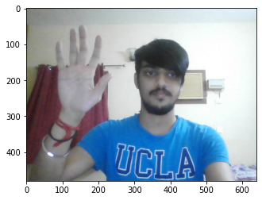
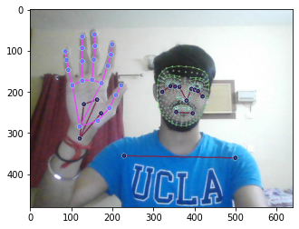

# RealTime Sign Language Detection using Action Recognition

## Approach

Real-Time Sign Language is commonly predicted using models whose architecture consists of multiple CNN layers followed by multiple LSTM layers. However , the accuracy of these state of the art models is pretty low.
On the other hand, this approach , Mediapipe Holistic with LSTM Model gives a much better accuracy. This approach produced better results with very less amount of data . Since this model trained on fewer parameters, it trained much faster thus resulting in lesser computation time.

## Project

This project is divided into two parts:
1. Keypoints extraction using MediaPipe Holistic
2. LSTM Model trained on these keypoints to predict realtime sign language using video sequences.

## Dataset

Data is collected using MediaPipe Holistic for 3 actions :
* Hello
* Thanks 
* I Love You

30 frames have been collected for each action and 30 sequences for each frame have been collected from real time actions using `Computer Vision` and `MediaPipe Holistic`.
For each sequence , 1662 keypoints have been extracted.
* Face Landmarks - 468*3
* Pose Landmarks - 33*4
* Left Hand Landmarks - 21*3
* Right Hand Landmarks - 21*3

 &ensp;&ensp;&ensp;&ensp;&ensp;&ensp;&ensp;&ensp;&ensp;
 &ensp;&ensp;&ensp;&ensp;&ensp;&ensp;&ensp;&ensp;&ensp; 

